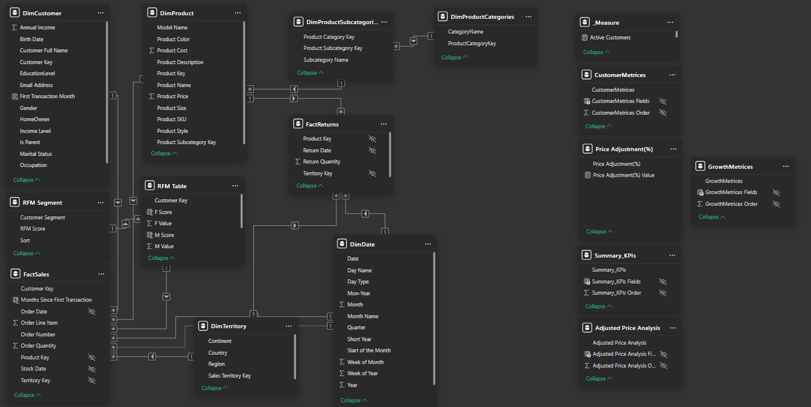

# **E-Commerce Sales Analysis Report**  

[Live Report Link](https://app.powerbi.com/view?r=eyJrIjoiMjg1ZTEzZWMtN2VjOS00NGM0LWJlNGItMjQ1ZWY0ZTM1YzBkIiwidCI6ImY5YWU1ZTMxLTQyMzYtNGZmNi05NWMwLTEyMzUxNDhmMTExMSIsImMiOjEwfQ%3D%3D)

1. [Executive Summary](#executive-summary)
2. [Project Overview](#project-overview) 
2. [Objectives](#objectives)
3. [Data Sources](#data-sources)
4. [Data Modeling](#data-modeling)
5. [Data Preprocessing](#data-preprocessing)
6. [Advance Dax Measures](#advanced-dax-measures)
7. [Insights Gained](#insights-gained) 
8. [Project Overview](#project-overview) 
9. [Key Findings](#key-findings) 
10. [Business Recommendations](#business-recommendations) 

---

## Executive Summary  

The E-Commerce Sales Analysis project provides a comprehensive evaluation of sales trends, customer behavior, and product performance using Power BI. By leveraging **RFM (Recency, Frequency, Monetary) segmentation**, the analysis identifies distinct customer groups, enabling targeted marketing strategies and improved customer retention. The project integrates sales transactions, customer data, product details, and return records to deliver actionable insights into business growth, profitability, and market opportunities. Key findings emphasize the importance of customer segmentation, product optimization, and geographic expansion to drive revenue and enhance customer satisfaction.

---

## Project Overview  

- **Data Cleaning & Preparation**  
  - Integrated data from multiple sources, including sales transactions, customer details, product information, and return records.  
  - Handled missing values, duplicates, and ensured data consistency.  

- **Data Modeling**  
  - Established relationships between **FactSales**, **FactReturn**, **DimCustomer**, **DimProduct**, **DimDate**, **DimProductCategories**, **DimProductSubCategories**, and **DimTerritory**.  
  - Implemented a **snowflake schema** to optimize query performance.  

- **Dashboard & Visualization Development**  
  - Created interactive dashboards displaying revenue, profit, order trends, and return metrics.  
  - Implemented drill-through reports for **product-level insights**.  
  - Used **filters and slicers** for dynamic data exploration.  
  - Applied **KPI indicators** to track target vs. actual performance.  
  - Highlighted **RFM segmentation** through tabular visualizations to identify customer groups and their purchasing behavior.  

- **Advanced Analytical Techniques**  
  - **RFM Analysis:** Segmented customers into groups based on Recency, Frequency, and Monetary value to tailor marketing strategies.  
  - **Profitability & Return Analysis:** Identified high-performing and underperforming products.  
  - **Price Sensitivity Testing:** Assessed the impact of price changes on demand and profitability.  

---

## Objectives  

1. **Analyze Sales Trends:** Identify revenue growth, sales performance, and seasonal variations.  
2. **Understand Customer Behavior:** Segment customers using **RFM analysis** to identify high-value, at-risk, and loyal customers.  
3. **Evaluate Product Performance:** Determine best-selling and most profitable product categories.  
4. **Monitor Return Rates:** Assess trends in product returns to improve customer satisfaction and quality control.  
5. **Optimize Pricing Strategies:** Explore the impact of price adjustments on demand and profitability.  
6. **Geographical Insights:** Identify high-revenue regions to strategize expansion and marketing efforts.  
7. **Enhance Business Strategies:** Provide actionable recommendations for increasing sales, reducing returns, and improving customer loyalty.
8. **RFM Analysis:** Segmented customers into groups based on Recency, Frequency, and Monetary value to tailor marketing strategies. 

---

## Data Sources  
The analysis is based on a structured data model integrating multiple datasets:  
- **FactSales:** Contains transaction-level sales data, including customer, product, and order details.  
- **FactReturns:** Tracks returned products, including return date and quantity.  
- **DimCustomer:** Stores customer demographic and behavioral data.  
- **DimProduct:** Includes product specifications such as price, SKU, and category.  
- **DimProductSubcategories & DimProductCategories:** Define product hierarchy and classification.  
- **DimDate:** Provides temporal attributes for time-based analysis.  
- **DimTerritory:** Contains geographical details of sales transactions.

---

## Data Modeling  
The project utilizes a **snowflake schema** to establish relationships between multiple tables, including **FactSales**, **FactReturns**, **DimCustomer**, **DimProduct**, **DimDate**, **DimProductCategories**, **DimProductSubCategories**, and **DimTerritory**. Below is the data model view:  

---
Data Modeling
## Data Preprocessing  
The following preprocessing steps were performed to ensure data quality and consistency:  

### **1. Data Exploration & Preprocessing**  
- Imported data from multiple formats (CSV, JSON, Excel, SQL).  
- Understood data types and structures.  
- Handled missing values (dropped or imputed).  
- Removed duplicates.  
- Performed basic string operations (lowercasing, stripping whitespace).  
- Converted data types (string ↔ numeric ↔ datetime).  

### **2. Data Cleaning**  
- Removed special characters and extra spaces.  
- Handled incorrect or inconsistent values.  
- Standardized text formats (e.g., case conversion).  
- Corrected date formats.  
- Handled categorical data (One-Hot Encoding, Label Encoding).  

### **3. Statistical Analysis**  
- Calculated mean, median, mode, standard deviation, min, max, range, and percentiles.  
- Performed frequency and distribution analysis.  

### **4. Data Transformation**  
- Sorted and filtered data.  
- Aggregated and grouped data (sum, avg, count, etc.).  
- Concatenated and merged datasets.  

---

## Advanced DAX Measures  
The following advanced DAX measures were created to derive key insights:  

| **Measure Name**               | **Expression**                                                                 |
|--------------------------------|-------------------------------------------------------------------------------|
| **Revenue**                    | `SUMX(FactSales, FactSales[Order Quantity] * RELATED(DimProduct[Product Price]))` |
| **Cost**                       | `SUMX(FactSales, FactSales[Order Quantity] * RELATED(DimProduct[Product Cost]))`  |
| **Profit**                     | `[Revenue] - [Cost]`                                                          |
| **Profit Margin (%)**          | `DIVIDE([Profit], [Revenue], BLANK())`                                        |
| **Return Rate (%)**            | `DIVIDE([Return Qty], [Sold Qty], BLANK())`                                   |
| **YoY Change (%) in Orders**   | `IF(ISBLANK([No. of Orders (PY)]), BLANK(), FORMAT(DIVIDE([No. of Orders] - [No. of Orders (PY)], [No. of Orders], BLANK()), "+0% ▲; -0% ▼"))` |
| **YoY Change (%) in Profit**   | `IF(ISBLANK([Profit (PY)]), BLANK(), FORMAT(DIVIDE([Profit] - [Profit (PY)], [Profit (PY)], BLANK()), "+0% ▲; -0% ▼"))` |
| **YoY Change (%) in Revenue**  | `IF(ISBLANK([Revenue (PY)]), BLANK(), FORMAT(DIVIDE([Revenue] - [Revenue (PY)], [Revenue (PY)], BLANK()), "+0% ▲; -0% ▼"))` |
| **R Value**                    | `DATEDIFF([Last Transaction Date], [Last Business Day], DAY)`                 |
| **Adjusted Retail Price**      | `VAR AvgPrice = AVERAGE(DimProduct[Product Price]) RETURN AvgPrice * (1 + 'Price Adjustment(%)'[Price Adjustment(%) Value])` |
| **Adjusted Revenue**           | `SUMX(FactSales, FactSales[Order Quantity] * [Adjusted Retail Price])`        |
| **Adjusted Profit**            | `[Adjusted Revenue] - [Cost]`                                                |
| **Target Orders**              | `[Orders(PM)] * 1.1`                                                         |
| **Target Profit**              | `[Profit(PM)] * 1.1`                                                         |
| **Order Gap**                  | `[Target Orders] - [No. of Orders]`                                          |
| **Profit Gap**                 | `[Target Profit] - [Profit]`                                                 |
| **Price Adjustment(%) Value**  | `SELECTEDVALUE('Price Adjustment(%)'[Price Adjustment(%)], 0)`                |

--- 

## Insights Gained  

The analysis of e-commerce sales has provided valuable insights into customer purchasing behavior, product performance, and overall business health. Key findings include:  

- **Sales Growth:** Orders, revenue, and profit have shown a steady increase over time, indicating positive business growth.  
- **Return Trends:** While return quantity fluctuates, the overall return rate has decreased, suggesting improved customer satisfaction or better return policies.  
- **Best-Selling Product Category:** The **"Accessories"** category has the highest sales volume.  
- **Most Profitable Product Sub-Category:** **"Road Bikes"** generate the highest profit.  
- **Customer Segmentation (RFM Analysis):**  
  - **High-Value Customers:** Customers with high monetary value and frequent purchases.  
  - **At-Risk Customers:** Customers with declining engagement or recency.  
  - **Loyal Customers:** Customers with consistent purchasing behavior.  
  - **Promising Customers:** Customers with potential for higher engagement and loyalty.  
- **Geographical Sales Distribution:** The USA, Australia, and Canada contribute the highest revenue.  
- **Price Adjustment Impact:** A slight price increase on top-selling products may enhance profitability without reducing demand.  

---

## Key Findings  

### **Sales & Profitability Trends**  
- Orders, revenue, and profit have consistently increased over time.  
- The **return quantity fluctuates**, but the **overall return rate is declining**, suggesting improved quality control and customer satisfaction.  

### **Product Performance Insights**  
- **"Accessories"** is the best-selling category, indicating a strong demand for smaller add-on purchases.  
- **"Road Bikes"** contribute the highest profit, making them key products for promotions and sales strategies.  
- A **price increase on top-selling products** can be tested to measure its impact on revenue and demand.  

### **Customer Behavior & RFM Segmentation**  
- **High-Value Customers:** Represent a small percentage but contribute significantly to revenue.  
- **At-Risk Customers:** Require re-engagement strategies to prevent churn.  
- **Loyal Customers:** Exhibit consistent purchasing behavior and high lifetime value.  
- **Promising Customers:** Show potential for increased engagement and loyalty.  

### **Geographic Sales Distribution**  
- The highest revenue comes from **the USA, Australia, and Canada**.  
- Expansion efforts in these regions could further enhance profitability.  

---

## Business Recommendations  

### **Customer Insights & Marketing Strategy**  
- **Loyalty Programs:** Reward **High-Value Customers** and **Loyal Customers** identified through RFM segmentation.  
- **Re-engagement Campaigns:** Target **At-Risk Customers** with personalized promotions to reduce churn.  
- **Personalized Offers:** Use RFM segmentation to deliver tailored offers and dynamic pricing strategies.  

### **Product & Pricing Strategy**  
- **Adjust Pricing for High-Demand Products:** Test a slight price increase on top-selling products to measure profitability impact.  
- **Stock Optimization:** Increase inventory for best-sellers and phase out low-performing products.  
- **Price Sensitivity Analysis:** Adjust pricing dynamically based on profitability impact metrics.  
- **Return Rate Reduction:** Address quality issues for high-return items to improve customer satisfaction.  

### **Sales & Business Growth Strategy**  
- **Leverage Road Bikes for Bundling & Upselling:** Bundle high-profit products like **"Road Bikes"** with accessories to drive additional sales.  
- **Continue Reducing Return Rates:** Investigate customer feedback on frequently returned products and improve product descriptions.  
- **Expansion in High-Demand Regions:** Utilize geographical insights to explore new markets in the USA, Australia, and Canada.  
- **AI-Powered Forecasting:** Implement machine learning to predict sales trends and adjust stock levels proactively.  
- **Sales Team Performance Tracking:** Use sales data to evaluate employee efficiency and incentivize high performers.  

---

[Live Report Link](https://app.powerbi.com/view?r=eyJrIjoiMjg1ZTEzZWMtN2VjOS00NGM0LWJlNGItMjQ1ZWY0ZTM1YzBkIiwidCI6ImY5YWU1ZTMxLTQyMzYtNGZmNi05NWMwLTEyMzUxNDhmMTExMSIsImMiOjEwfQ%3D%3D)

---